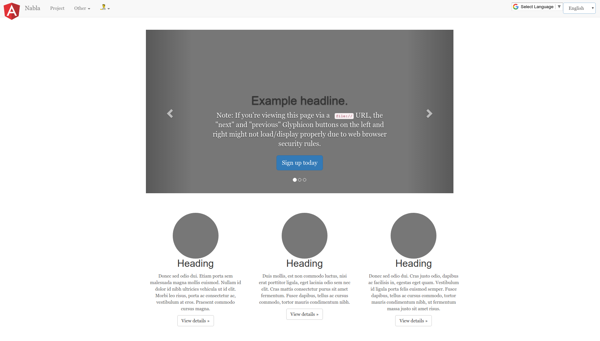

# Nabla Bower Sample

[](http://www.apache.org/licenses/LICENSE-2.0.html)
[](https://opensource.org/licenses/MIT)
[](https://github.com/AlbanAndrieu/nabla-servers-bower-sample/actions/workflows/maven-build.yml)
[](https://sonarcloud.io/summary/new_code?id=com.nabla.project.servers.sample%3Abower-sample)

A Maven-based Java web application demonstrating a Bower sample with Eclipse Jetty server deployment. This project showcases the integration of Java backend (JAX-RS/Jersey REST APIs) with HTML/JavaScript frontend assets.



## Table of Contents

- [Features](#features)
- [Prerequisites](#prerequisites)
- [Quick Start](#quick-start)
- [Building](#building)
- [Running](#running)
- [Testing](#testing)
- [Project Structure](#project-structure)
- [Configuration](#configuration)
- [Development](#development)
- [Troubleshooting](#troubleshooting)
- [Contributing](#contributing)
- [License](#license)

## Features

- ✅ **Java 11+** backend with JAX-RS (Jersey) REST APIs
- ✅ **Eclipse Jetty 9.4.x** embedded server
- ✅ **Maven** build system with wrapper
- ✅ **Integration tests** with JUnit
- ✅ **Static content** serving (HTML, CSS, JavaScript)
- ✅ **CI/CD** with GitHub Actions
- ✅ **Code quality** monitoring with SonarCloud

## Prerequisites

- **Java**: JDK 11 or higher
- **Maven**: 3.6+ (or use included Maven wrapper `./mvnw`)
- **curl** or web browser for testing

## Quick Start

1. **Clone the repository**
   ```bash
   git clone https://github.com/AlbanAndrieu/nabla-servers-bower-sample.git
   cd nabla-servers-bower-sample
   ```

2. **Build the project**
   ```bash
   ./mvnw clean package -DskipTests -Dmaven.exec.skip=true
   ```

3. **Run the application**
   ```bash
   ./mvnw jetty:run -Dmaven.exec.skip=true
   ```

4. **Test the application**
   ```bash
   curl http://localhost:9090/test/rest/books/test
   # Expected output: Test
   ```

## Building

### Standard Build (Java Backend Only)

This skips the frontend build which requires Node.js:

```bash
./mvnw clean package -DskipTests -Dmaven.exec.skip=true
```

### Full Build (with Frontend)

If you have Node.js installed and want to build frontend assets:

```bash
PUPPETEER_SKIP_CHROMIUM_DOWNLOAD=true ./mvnw clean package
```

### Build Output

After a successful build, you'll find:
- **WAR file**: `target/test.war` (deployable web archive)
- **Compiled classes**: `target/classes/`
- **Test classes**: `target/test-classes/`

## Running

### Using Jetty Maven Plugin (Development)

```bash
./mvnw jetty:run -Dmaven.exec.skip=true
```

The application will be available at:
- **Base URL**: http://localhost:9090/test/
- **REST API**: http://localhost:9090/test/rest/books/test

Press `Ctrl+C` to stop the server.

### Using Standalone Jetty (Production)

1. Build the WAR file:
   ```bash
   ./mvnw clean package -DskipTests -Dmaven.exec.skip=true
   ```

2. Deploy to Jetty:
   ```bash
   # Copy target/test.war to your Jetty installation's webapps directory
   cp target/test.war $JETTY_HOME/webapps/
   ```

### Custom Port Configuration

To run on a different port:

```bash
./mvnw jetty:run -Djetty.port=8080 -Djetty.stop.port=8081 -Dmaven.exec.skip=true
```

## Testing

### Run Unit Tests

```bash
./mvnw test
```

### Run Integration Tests

Integration tests start an embedded Jetty server and test the deployed application:

```bash
./mvnw verify -Prun-integration-test
```

### Manual Testing

With the server running, test the REST endpoints:

```bash
# Test the books endpoint
curl http://localhost:9090/test/rest/books/test

# Expected output: Test
```

## Project Structure

```
nabla-servers-bower-sample/
├── .github/
│   ├── copilot-instructions.md    # GitHub Copilot instructions
│   └── workflows/                  # GitHub Actions CI/CD
├── app/                            # Frontend assets (HTML, CSS, JS)
│   ├── index.html
│   ├── scripts/
│   └── styles/
├── src/
│   ├── main/
│   │   ├── java/                   # Java source code
│   │   │   └── com/test/project/sample/
│   │   │       ├── App.java        # Main application class
│   │   │       ├── BookResource.java  # REST API endpoints
│   │   │       └── ...
│   │   ├── resources/              # Application resources
│   │   └── webapp/WEB-INF/         # Web application config
│   │       └── web.xml
│   └── test/
│       └── java/                   # Test code
│           └── com/test/project/sample/
│               └── DeploymentITest.java
├── pom.xml                         # Maven build configuration
├── mvnw                            # Maven wrapper script (Linux/Mac)
├── mvnw.cmd                        # Maven wrapper script (Windows)
└── README.md                       # This file
```

## Configuration

### Maven Configuration

Key properties in `pom.xml`:

```xml
<properties>
    <jetty.port>9090</jetty.port>           <!-- Jetty HTTP port -->
    <jetty.stop.port>8089</jetty.stop.port> <!-- Jetty shutdown port -->
    <jdk.level>11</jdk.level>               <!-- Java version -->
    <jetty9.version>9.4.19.v20190610</jetty9.version>
</properties>
```

### Web Application Configuration

The application is deployed with context path `/test`, configured in `pom.xml`:

```xml
<webApp>
    <contextPath>/test</contextPath>
</webApp>
```

## Development

### Adding New REST Endpoints

1. Create a new class in `src/main/java/com/test/project/sample/`:

```java
@Path("/myresource")
public class MyResource {
    @GET
    @Produces(MediaType.TEXT_PLAIN)
    public String hello() {
        return "Hello World!";
    }
}
```

2. Register it in `MyApplication.java` or let Jersey auto-discover it.

3. Rebuild and test:
   ```bash
   ./mvnw clean package -DskipTests -Dmaven.exec.skip=true
   ./mvnw jetty:run -Dmaven.exec.skip=true
   curl http://localhost:9090/test/rest/myresource
   ```

### Modifying Frontend Assets

Frontend files are in the `app/` directory:

1. Edit HTML/CSS/JS files in `app/`
2. Rebuild the WAR:
   ```bash
   ./mvnw clean package -DskipTests -Dmaven.exec.skip=true
   ```
3. Restart Jetty to see changes

### Hot Reload (Development Mode)

For Java code changes, Jetty maven plugin supports hot reload:

```bash
./mvnw jetty:run -Dmaven.exec.skip=true
# Make code changes, Jetty will automatically reload
```

## Troubleshooting

### Build Fails with "Parent POM not found"

**Solution**: The project is configured to work without the parent POM. This error should not occur in the current version.

### Build Fails with NPM/Puppeteer Errors

**Solution**: Skip the frontend build:
```bash
./mvnw clean package -DskipTests -Dmaven.exec.skip=true
```

Or set the environment variable:
```bash
export PUPPETEER_SKIP_CHROMIUM_DOWNLOAD=true
./mvnw clean package
```

### Port Already in Use

**Solution**: Either stop the process using the port or use a different port:
```bash
./mvnw jetty:run -Djetty.port=8080 -Djetty.stop.port=8081 -Dmaven.exec.skip=true
```

### Web Resources Not Found (404 errors)

**Solution**: Ensure the `app/` directory exists and contains your frontend files. The build copies files from `app/` to the WAR.

### Integration Tests Fail

**Solution**: Make sure no other process is using port 9090:
```bash
lsof -i :9090
# Kill any process using the port
```

### Clean Build

If you encounter persistent build issues:
```bash
./mvnw clean
rm -rf target/
rm -rf ~/.m2/repository/com/nabla/
./mvnw clean package -DskipTests -Dmaven.exec.skip=true
```

## Docker Support

Build and run with Docker:

```bash
# Build Docker image
docker build -t nabla-bower-sample .

# Run container
docker run -p 9090:9090 nabla-bower-sample
```

Access at: http://localhost:9090/test/

## CI/CD

This project uses GitHub Actions for continuous integration:

- **maven-build.yml**: Builds and tests the project on every push
- **Quality checks**: SonarCloud analysis, security scanning

View build status: [GitHub Actions](https://github.com/AlbanAndrieu/nabla-servers-bower-sample/actions)

## Contributing

We welcome contributions! Please see [CONTRIBUTING.md](CONTRIBUTING.md) for guidelines.

### Reporting Issues

Use the [GitHub issue tracker](https://github.com/AlbanAndrieu/nabla-servers-bower/issues) to report bugs or request features.

### Pull Requests

1. Fork the repository
2. Create a feature branch: `git checkout -b feature/my-feature`
3. Make your changes and commit: `git commit -am 'Add new feature'`
4. Push to the branch: `git push origin feature/my-feature`
5. Submit a pull request

## License

This project is licensed under both:

- [Apache License 2.0](http://www.apache.org/licenses/LICENSE-2.0.html)
- [MIT License](https://opensource.org/licenses/MIT)

Choose the license that best suits your needs.

## Resources

- **GitHub Repository**: https://github.com/AlbanAndrieu/nabla-servers-bower-sample
- **Eclipse Jetty Documentation**: https://www.eclipse.org/jetty/documentation/
- **Jersey (JAX-RS) Documentation**: https://eclipse-ee4j.github.io/jersey/
- **Maven Documentation**: https://maven.apache.org/guides/

## Contact

**Maintainer**: Alban Andrieu

- GitHub: [@AlbanAndrieu](https://github.com/AlbanAndrieu)
- LinkedIn: [nabla](https://fr.linkedin.com/in/nabla/)

---

**Note**: For GitHub Copilot users, see [.github/copilot-instructions.md](.github/copilot-instructions.md) for detailed development guidelines.
